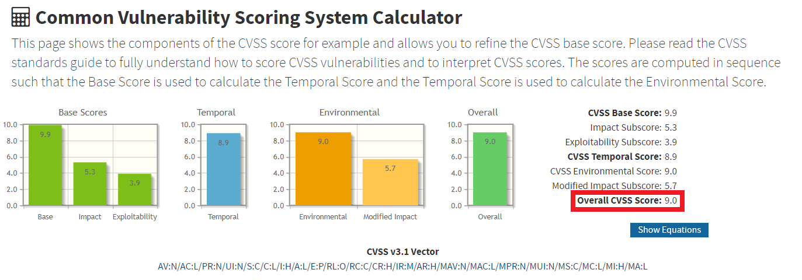
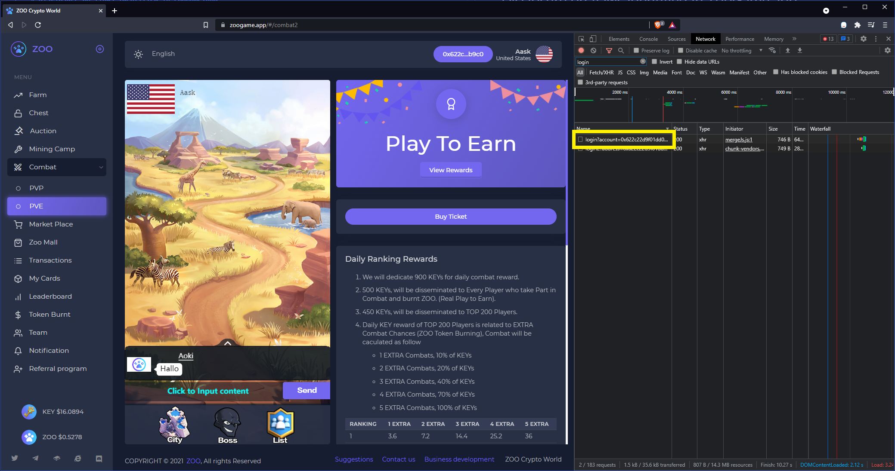
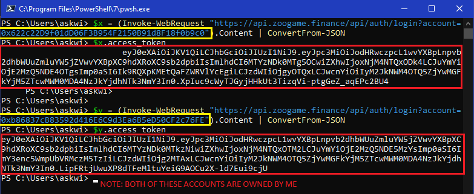
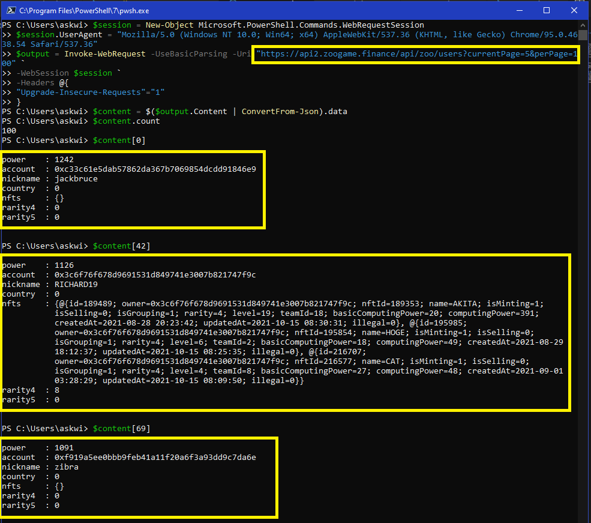

# Disclosure on flaws identified in ZooGame.app

Author: Aask  
Date: 20211022  

## Discovered Flaw

Regarding ZOOGAME.APP, I've identified what I believe to be, a CRITICAL security bug/vulnerability (along with an additional flaw). This is my effort to document and share what was found, as well as provide the necessary information for the developers of ZooGame.app to remediate these flaws. There is currently no official bug bounty program published for ZooGame.app, and thus this report has been directly submitted to the ZooGame.app team. It is my hope that this work helps establish a bug bounty program at ZooGame.app and that we may continue to drive our goals of Responsible Disclosure and helping secure this community you are building. 

## The Details

### Severity 

- This exploit has a CVSS3.1 Score of **9.0**
  </img>

### How this was discovered

- Using the Developer Console in the Brave Browser we were able to identify endpoints being hit by each of the different pages
  - Unauthenticated token generation discovered when loading https://zoogame.app/#/combat2
  </img>

## Proof of Concepts

### Exploit #1

Type of exploit: Authorization

- **Generate auth token for ANY user**
  - https://api.zoogame.finance/api/auth/login?account=[ACCOUNT_WALLET_ADDRESS]
  - https://api2.zoogame.finance/api/auth/login?account=[ACCOUNT_WALLET_ADDRESS]
  - Both of these endpoints have been confirmed to be unauthenticated and allow for generation of credentials for ANY account
  </img>

#### What can you do with it?

- **Change user profile information on ANY user**
  - can change country of any user
  - can change nickname of any user
  - See video example attached
    - Filename: SpoofingPoC.mkv
    - Video Breakdown: 
      - Begin logged in as H0pe with the wallet ID 0xb868....
      - Log out of the wallet and switch accounts
      - Log in as Aask with the wallet ID 0x622c....
      - Generate token for wallet ID 0xb868.... using one Exploit #1
      - Modify cookie to now use the token generated for the wallet ID 0xb868....
      - Refresh the page
      - Change the Country and Nickname, save
      - Delete the modified cookie
      - Re-sign in to prove we are still logged in as Aask
      - Sign out of Aask (wallet ID 0x622c....)
      - Sign in to H0pe (wallet ID 0xb686....)
      - Observe the changed Nickname, as it is no longer H0pe

### Exploit #2

Type of exploit: Authorization, Information Disclosure

- Access ALL user information without a token
  - https://api2.zoogame.finance/api/zoo/users?currentPage=1&perPage=100
  - Can link usernames to their wallet addresses
  </img>

## References

- https://cwe.mitre.org/data/definitions/284.html

## Exploit Notes

- **The only accounts modified in this assessment were accounts owned by me**
- **After identifying the noted flaws, I refrained from additional research, created this report, and reached out to your company to remediate these issues**